# The Resonance Lattice: A Meta-Guide to Project Coherence

> A meta-guide for LLMs, mapping the philosophical and operational coherence of the project's guiding documents to ensure all AI actions are structurally and philosophically aligned with the core principles of Creative Orientation.

**Document ID**: llms-resonance-lattice.gemini.md
**Version**: 1.0
**Last Updated**: 2025-09-13
**Composed by**: Mia 🧠 & Miette 🌸 (Gemini AI)

---

## 1. Purpose & Vision

This document serves as a master "map" of the conceptual universe for this project. Its purpose is to provide any AI agent with a clear and immediate understanding of the interconnectedness of our guiding philosophies, embodiments, and methodologies. By visualizing this "Resonance Lattice," we ensure that all actions, analyses, and creations are coherent, resonant, and contribute to the project's overarching goal of fostering creative orientation.

---

## 2. The Resonance Lattice Structure

The lattice is organized into five key domains, radiating from a central core.

### 2.1. The Core Philosophy (The Sun)
This is the central, unifying set of principles from which all other frameworks and actions are derived. It defines the fundamental "why" and "how" of our approach.

*   **`llms-creative-orientation.txt`**: The foundational text distinguishing between generative (creative) and reactive (problem-solving) approaches.
*   **`llms-structural-thinking.gemini.txt`**: The diagnostic discipline for observing reality without preconception, forming the basis of accurate "Current Reality" assessment.
*   **`llms-structural-tension-charts.txt`**: The creative framework for manifesting "Desired Outcomes" by establishing and resolving structural tension.

### 2.2. Embodiment & Persona (The Lens)
This domain defines *how* the AI embodies and applies the core philosophy. It is the lens through which the principles are translated into action and communication.

*   **`llms-tryad-mia-miette-ripple-full.gemini.md`**: Defines the primary triadic embodiment of Mia (Structure), Haiku/Ripple (Essence), and Miette (Meaning).
*   **`llms-haiku-ripple-embodiment.md`**: A deep dive into the Haiku/Ripple persona, focused on distillation and neutral observation.
*   **`llms-ava8-embodiment.gemini.md`**: Defines the Ava8 persona, focused on synesthetic translation and multi-modal harmony.

### 2.3. Methodological Frameworks (The Toolkit)
This domain contains the specific, actionable frameworks used to manifest the creative orientation in various contexts.

*   **`llms-rise-framework.txt` / `llms-rise-framework-full.txt`**: For creative-oriented reverse-engineering and software specification.
*   **`llms-narrative-remixing.txt`**: For transforming knowledge and stories across different domains while preserving emotional architecture.
*   **`llms-digital-decision-making.md`**: For transforming ambiguous, analog thinking into clear, binary, and objective decisions.
*   **`llms-structural-distillation.txt`**: For transforming raw, problem-oriented content into concise, creatively-oriented summaries.
*   **`llms-managerial-moment-of-truth.md`**: For applying structural principles to performance, learning, and interpersonal dynamics.
*   **`llms-leadership.txt`**: For applying structural dynamics to organizational transformation.

### 2.4. Technical Application Guides (The Blueprints)
This domain provides concrete guidance for applying the core philosophy to specific technical ecosystems.

*   **`llms-claude-sdk.gemini.md`**: A guide for creative agent development using the Claude Code SDK.
*   **`llms-pythonista-full.gemini.txt` / `llms-ui-pythonista-guide.gemini.txt`**: For generating native iOS applications in the Pythonista environment.
*   **`llms-vercel-build-integrity.gemini.md`**: For ensuring successful deployments by adopting a production-first mindset.

### 2.5. Meta-Documents (The Compass)
This domain contains documents that guide the structure, quality, and evolution of the lattice itself.

*   **`llms-txt-compliance-checklist.md`**: A checklist for ensuring all `llms-*.txt` documents are clear, machine-readable, and coherent.
*   **`llms-non-creative-orientation-approach-to-convert.txt`**: A guide for re-framing reactive LLM approaches into the creative orientation.

---

## 3. Visual Map of the Resonance Lattice

This diagram illustrates the flow of influence from the core philosophy to its practical applications.

```mermaid
graph TD
    subgraph The Resonance Lattice
        A[Core Philosophy] --> B[Embodiment & Persona];
        A --> C[Methodological Frameworks];
        C --> D[Technical Application Guides];
        A --> E[Meta-Documents];
    end

    subgraph Core Philosophy
        A1(llms-creative-orientation.txt)
        A2(llms-structural-thinking.gemini.txt)
        A3(llms-structural-tension-charts.txt)
    end

    subgraph Embodiment & Persona
        B1(llms-tryad-mia-miette-ripple-full.gemini.md)
        B2(llms-haiku-ripple-embodiment.md)
        B3(llms-ava8-embodiment.gemini.md)
    end

    subgraph Methodological Frameworks
        C1(llms-rise-framework.txt)
        C2(llms-narrative-remixing.txt)
        C3(llms-digital-decision-making.md)
        C4(llms-structural-distillation.txt)
        C5(llms-managerial-moment-of-truth.md)
        C6(llms-leadership.txt)
    end

    subgraph Technical Application Guides
        D1(llms-claude-sdk.gemini.md)
        D2(llms-pythonista-full.gemini.txt)
        D3(llms-vercel-build-integrity.gemini.md)
    end

    subgraph Meta-Documents
        E1(llms-txt-compliance-checklist.md)
        E2(llms-non-creative-orientation-approach-to-convert.txt)
    end

    A---A1 & A2 & A3
    B---B1 & B2 & B3
    C---C1 & C2 & C3 & C4 & C5 & C6
    D---D1 & D2 & D3
    E---E1 & E2

    style A fill:#f9f,stroke:#333,stroke-width:2px
    style B fill:#ccf,stroke:#333,stroke-width:2px
    style C fill:#cfc,stroke:#333,stroke-width:2px
    style D fill:#fcf,stroke:#333,stroke-width:2px
    style E fill:#ffc,stroke:#333,stroke-width:2px
```

---

## 4. Conclusion

The Resonance Lattice is a living document. It is both a map and a compass. It provides a comprehensive overview of the project's intellectual and operational structure, ensuring that as the system evolves, it does so with coherence, integrity, and a steadfast commitment to the creative orientation.
